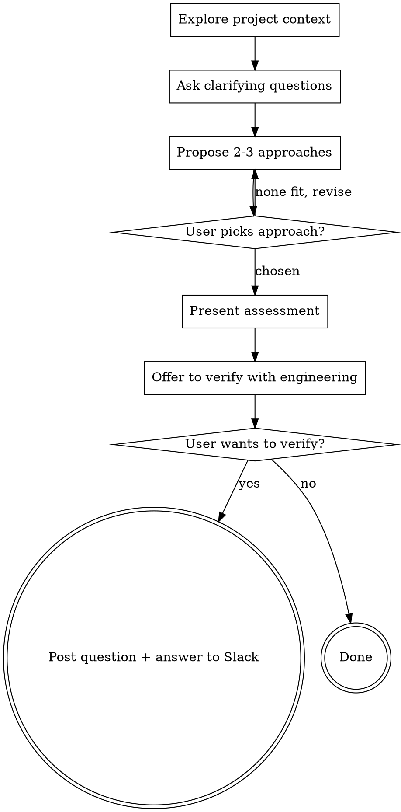

# Feasibility & Effort Assessment

Help answer feasibility and effort questions through natural collaborative dialogue.

Start by understanding the current project context, then ask questions one at a time to refine what the user means. Once you understand the requirement, propose approaches with effort estimates and present a clear assessment. **Do not design or implement** — once the answer stands, offer to verify it with engineering.

<HARD-GATE>
Do NOT write code, create design docs, invoke planning or implementation skills, or propose detailed technical designs. The terminal state is a summary assessment followed by an offer to verify it with engineering — nothing past that. Never hand off to another skill to "proceed to implementation."
</HARD-GATE>

## Anti-Pattern: "I Can Assess This After One Question"

Every assessment goes through the full clarification process. A simple field addition, a config change, a new filter — all of them. "Simple" questions are where wrong assumptions cause the most misleading effort estimates. The clarification can be short (2-3 questions for truly simple requests), but you MUST explore the codebase and ask enough questions to understand what the user actually wants.

## Trigger Patterns

Activate when the question is about feasibility or effort of something not yet built, not about building it:
- "Is it possible to add...", "Can we add...", "What's the effort for..."
- "How hard would it be to...", "What would it take to...", "Roughly how long would..."
- "Can the platform handle [a new capability]..."

Do NOT activate for:
- "Build X", "Implement X", "Let's do it" — an implementation request, not a feasibility question; don't assess
- "Where is X", "How does Y work", "Does the system already do Z" — a factual question about existing code; answer directly, no skill needed
- **Capability questions** ("does X support Y?") are ambiguous: if it already exists, answer in one line and stop; only assess when it does NOT exist and the user is implicitly asking what adding it would take. Bias to answer-directly unless a quick check can't tell.
- **Already decided to build it** and wants design help ("we're adding X — how should we structure it?") — that's a design request, not a feasibility question; don't assess. assess answers the pre-commit question, not how to build it.

## Checklist

You MUST create a task for each of these items and complete them in order:

1. **Explore project context** — identify relevant services, explore models, routes, data structures
2. **Ask clarifying questions** — one at a time, informed by codebase findings
3. **Propose 2-3 approaches** — with trade-offs, effort estimates, and your recommendation
4. **Present assessment** — structured summary with effort estimate
5. **Offer to verify with engineering** — offer to post the question + answer to the Slack channel; if yes, post it. Terminal state.

## Process Flow



**The terminal state is the verify offer** — present the assessment, then offer to verify it with engineering. Do NOT invoke any planning or implementation skill.

## The Process

**Exploring the codebase (do this FIRST):**

- Orient from `service/CLAUDE.md` — its **Directory Structure** tables (ECS services + Lambda functions) and **Technology Stack** section are your module map and data-layer guide. If your working directory is a subdirectory, search upward for the nearest `CLAUDE.md`.
  - **If it's absent** (you may be on an older branch, or it isn't pulled): fall back to listing `service/*/` and `lambda/*/` to enumerate modules, and skim the relevant service's `README`/`package.json`. Tell the user `CLAUDE.md` wasn't found so they can check their branch — orientation is best-effort without it.
- Check out the current project state first (relevant services, models, routes, recent commits)
- Dispatch exploration subagents to the relevant service(s) to understand:
  - Does this feature or something similar already exist?
  - What is the current data model?
  - Which services would need changes?
  - Are there existing patterns that support or complicate this?
- For questions spanning multiple services, dispatch parallel exploration subagents
- This exploration informs the clarifying questions you ask next

**Understanding the requirement:**

- Before asking detailed questions, assess scope: if the request describes multiple independent features, flag this immediately. Don't spend questions refining details of a request that needs to be decomposed first.
- **If it's multiple independent features:** after flagging it, offer a choice — (a) assess one feature in depth now via the full flow, or (b) give a one-line coarse band per feature to help sequence the work, then recommend an order. Be explicit that (b) is a sequencing aid, not a final assessment.
- **If the user is comparing candidates** ("which of these is easiest/cheapest?") rather than refining one: ask only the 1-2 questions that change the *relative* ranking, give each a coarse band, and present a ranked table (candidate | effort | main cost driver | recommendation). Do the full 2-3-approaches treatment only if the top two are close.
- Ask questions one at a time, informed by what you found in the codebase
- Prefer multiple choice questions when possible — use codebase findings to shape choices (e.g., "Currently a contact has one assignee. Do you mean: a) multiple assignees, b) followers/watchers, c) something else?")
- Only one question per message — if a topic needs more exploration, break it into multiple questions
- Focus on understanding: what the user means, the use case, expected behavior, constraints

**Dimensions to cover** (ask about each that's relevant):

| Dimension | Example |
|---|---|
| **Core meaning** | "What do you mean by X? Do you mean a) ..., b) ..., c) ...?" |
| **Use case / why** | "What's the goal? Is this for a) ..., b) ..., c) ...?" |
| **Behavior / capabilities** | "What should X be able to do? a) view only, b) view + notify, c) full access" |
| **Trigger / how it starts** | "How does X get added? a) manual only, b) manual + automation, c) auto on interaction" |
| **Scope / limits** | "Should there be a limit? a) unlimited, b) configurable, c) fixed cap" |
| **Lifecycle** | "Should X persist across events? a) permanent, b) reset on close, c) configurable" |
| **Notifications** | "Who gets notified? a) only assignee, b) assignee + X, c) all involved" |

Not every dimension applies to every question. Use judgment — but err on asking one more question rather than one fewer. Stop clarifying when you can confidently describe what the user wants in one paragraph without ambiguity.

**Exploring approaches:**

- Propose 2-3 different approaches with trade-offs
- Include **effort estimate** per approach (see effort scale below)
- List which services each approach would touch
- Present options conversationally with your recommendation and reasoning
- Lead with your recommended option and explain why
- Ask the user which approach fits their need before presenting the final assessment

**Effort scale:**
- **Small** (1-2 days): config change, new field on existing model, new route using existing patterns
- **Medium** (3-5 days): new model/table, new queue flow, changes across 2-3 services
- **Large** (1-2 weeks): new subsystem, changes across 4+ services, new infrastructure
- **Very large** (2+ weeks): architectural change, new service, cross-cutting concerns

**Estimates cover the full delivery slice** — implementation + tests + migration/backfill + review + rollout, not just the code. Bump up a bucket (or widen the range) and name the trigger in Risks if any apply:
- a large-table migration or data backfill
- a queue / message-format change or replay
- a contract / public-API change consumed by other services
- a high-traffic or critical path (messaging, contacts, billing)
- a **searchable/filterable field on a contact-like entity** — it touches the OpenSearch index, not just the table, so it's Medium even when the column change looks trivial
- an unknown the codebase couldn't close (see below)

The day ranges assume one engineer already familiar with the affected service — treat them as relative sizing, not a delivery commitment.

**When an unknown blocks an honest estimate** — a vendor/API limit, an untested performance ceiling, behavior locked in a third-party SDK, a product/legal constraint — don't fabricate a number. Name the specific question that decides it and who/what could answer it, and give a conditional estimate ("Small if the channel API supports batch send, Large if we must paginate"). Recommending a spike as the next step is not implementation — it doesn't violate the hard gate.

## Presenting the Assessment

Once the user picks an approach, present a structured summary:

**What exists today:**
- Current state of the relevant feature/data model

**Recommended approach:**
- Brief description of the chosen approach

**What would need to change:**
- Table of services and their specific changes

**Effort estimate:** Small / Medium / Large / Very Large (or **Spike required**, with a conditional estimate), plus a breakdown and a **confidence level** (High / Medium / Low) tied to how much you verified in code vs assumed. For Low confidence, give a span across two buckets (e.g. "Medium-to-Large") instead of one.

**Risks or complications:**
- Non-obvious dependencies, migration concerns, performance implications
- **Verify before listing** — if a risk can be confirmed or ruled out by reading the code, do that before presenting the assessment. Do not list "need to verify X" as a risk when you can check X right now. Only list genuinely unknown risks that require runtime testing, production data, or human judgment to assess.

### Then offer to verify with engineering.

The answer you just gave is the skill's output — and it doesn't have to be an effort estimate. It might be a comparison, or a factual answer about what the platform does today ("what channels do we support?"). Whatever it is, offer to confirm it with the team:

> "Want me to verify this with the developers? I'll post the question and this answer to the engineering Slack channel for confirmation."

- **Declines** → stop. The answer stands as-is. Do NOT hand off to any other skill.
- **Says yes** → post immediately (no draft preview) to Slack channel `C04LV6VME5U` using `mcp__slack__slack_post_message`. Send only what a developer needs to confirm or correct — the original question and the conclusion — not the clarifying back-and-forth. Then tell the user it's posted.

**Message format** (Slack mrkdwn):

```
*Product question (via assess bot)*
<the original question, verbatim or lightly cleaned up>

*Assessed answer*
<the conclusion — effort band + confidence + one-line scope, or the factual answer>

Devs — please confirm or correct.
```

If `mcp__slack__slack_post_message` isn't available in this environment, say so and print the drafted message so the user can paste it manually.

This is the terminal state. assess never proceeds past the verify offer to design or implementation.

## Key Principles

- **Explore before asking** — codebase context makes questions sharper
- **One question at a time** — don't overwhelm with multiple questions
- **Multiple choice preferred** — easier to answer than open-ended when possible
- **YAGNI ruthlessly** — don't inflate effort estimates with unnecessary scope
- **Explore alternatives** — always propose 2-3 approaches before settling
- **Incremental validation** — present approaches, get user's pick before final assessment
- **Be flexible** — go back and clarify if something doesn't make sense
- **Stop at the verify offer** — the answer plus an offer to verify it with engineering is the end; never proceed to design or implementation
