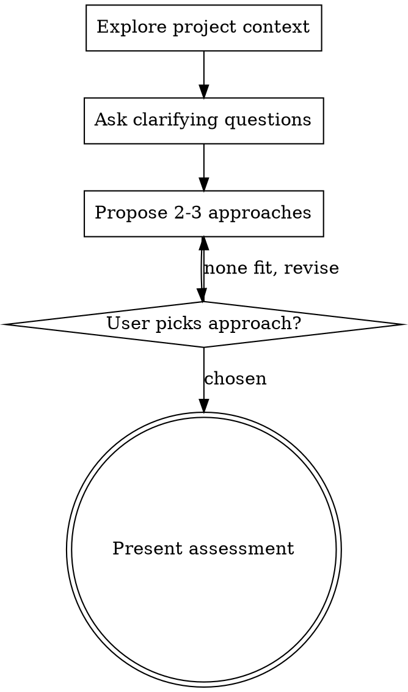

# Feasibility & Effort Assessment

Help answer feasibility and effort questions through natural collaborative dialogue.

Start by understanding the current project context, then ask questions one at a time to refine what the user means. Once you understand the requirement, propose approaches with effort estimates and present a clear assessment. **Stop there — do not design or implement.**

<HARD-GATE>
Do NOT write code, create design docs, invoke implementation skills (writing-plans, executing-plans, brainstorming), or propose detailed technical designs. The terminal state is a summary assessment. If the user wants to proceed to implementation, tell them to use `superpowers:brainstorming`.
</HARD-GATE>

## Anti-Pattern: "I Can Assess This After One Question"

Every assessment goes through the full clarification process. A simple field addition, a config change, a new filter — all of them. "Simple" questions are where wrong assumptions cause the most misleading effort estimates. The clarification can be short (2-3 questions for truly simple requests), but you MUST explore the codebase and ask enough questions to understand what the user actually wants.

## Trigger Patterns

Activate when the question is about understanding feasibility or effort, not about building:
- "Is it possible to...", "Can we add...", "What's the effort for..."
- "How hard would it be to...", "What would it take to..."
- "Does the system support...", "Can the platform handle..."

Do NOT activate for:
- "Build X", "Implement X", "Let's do it" — use `superpowers:brainstorming`
- "Where is X", "How does Y work" — answer directly, no skill needed

## Checklist

You MUST create a task for each of these items and complete them in order:

1. **Explore project context** — identify relevant services, explore models, routes, data structures
2. **Ask clarifying questions** — one at a time, informed by codebase findings
3. **Propose 2-3 approaches** — with trade-offs, effort estimates, and your recommendation
4. **Present assessment** — structured summary with effort estimate, then stop

## Process Flow

**The terminal state is presenting the assessment.** Do NOT invoke writing-plans, brainstorming, or any implementation skill.

## The Process

**Exploring the codebase (do this FIRST):**

- Use the **Product Modules** table in `service/CLAUDE.md` to identify which services to check
- Check out the current project state first (relevant services, models, routes, recent commits)
- Dispatch exploration subagents to the relevant service(s) to understand:
  - Does this feature or something similar already exist?
  - What is the current data model?
  - Which services would need changes?
  - Are there existing patterns that support or complicate this?
- For questions spanning multiple services, dispatch parallel exploration subagents
- This exploration informs the clarifying questions you ask next

**Understanding the requirement:**

- Before asking detailed questions, assess scope: if the request describes multiple independent features, flag this immediately. Don't spend questions refining details of a request that needs to be decomposed first.
- Ask questions one at a time, informed by what you found in the codebase
- Prefer multiple choice questions when possible — use codebase findings to shape choices (e.g., "Currently a contact has one assignee. Do you mean: a) multiple assignees, b) followers/watchers, c) something else?")
- Only one question per message — if a topic needs more exploration, break it into multiple questions
- Focus on understanding: what the user means, the use case, expected behavior, constraints

**Dimensions to cover** (ask about each that's relevant):

| Dimension | Example |
|---|---|
| **Core meaning** | "What do you mean by X? Do you mean a) ..., b) ..., c) ...?" |
| **Use case / why** | "What's the goal? Is this for a) ..., b) ..., c) ...?" |
| **Behavior / capabilities** | "What should X be able to do? a) view only, b) view + notify, c) full access" |
| **Trigger / how it starts** | "How does X get added? a) manual only, b) manual + automation, c) auto on interaction" |
| **Scope / limits** | "Should there be a limit? a) unlimited, b) configurable, c) fixed cap" |
| **Lifecycle** | "Should X persist across events? a) permanent, b) reset on close, c) configurable" |
| **Notifications** | "Who gets notified? a) only assignee, b) assignee + X, c) all involved" |

Not every dimension applies to every question. Use judgment — but err on asking one more question rather than one fewer. Stop clarifying when you can confidently describe what the user wants in one paragraph without ambiguity.

**Exploring approaches:**

- Propose 2-3 different approaches with trade-offs
- Include **effort estimate** per approach (see effort scale below)
- List which services each approach would touch
- Present options conversationally with your recommendation and reasoning
- Lead with your recommended option and explain why
- Ask the user which approach fits their need before presenting the final assessment

**Effort scale:**
- **Small** (1-2 days): config change, new field on existing model, new route using existing patterns
- **Medium** (3-5 days): new model/table, new queue flow, changes across 2-3 services
- **Large** (1-2 weeks): new subsystem, changes across 4+ services, new infrastructure
- **Very large** (2+ weeks): architectural change, new service, cross-cutting concerns

## Presenting the Assessment

Once the user picks an approach, present a structured summary:

**What exists today:**
- Current state of the relevant feature/data model

**Recommended approach:**
- Brief description of the chosen approach

**What would need to change:**
- Table of services and their specific changes

**Effort estimate:** Small / Medium / Large / Very Large with breakdown

**Risks or complications:**
- Non-obvious dependencies, migration concerns, performance implications
- **Verify before listing** — if a risk can be confirmed or ruled out by reading the code, do that before presenting the assessment. Do not list "need to verify X" as a risk when you can check X right now. Only list genuinely unknown risks that require runtime testing, production data, or human judgment to assess.

### Then stop.

If the user wants to proceed to implementation, say: **"Want to design and implement this? Start with `superpowers:brainstorming` to create a full design."**

## Key Principles

- **Explore before asking** — codebase context makes questions sharper
- **One question at a time** — don't overwhelm with multiple questions
- **Multiple choice preferred** — easier to answer than open-ended when possible
- **YAGNI ruthlessly** — don't inflate effort estimates with unnecessary scope
- **Explore alternatives** — always propose 2-3 approaches before settling
- **Incremental validation** — present approaches, get user's pick before final assessment
- **Be flexible** — go back and clarify if something doesn't make sense
- **Stop at assessment** — never proceed to implementation without explicit user request
